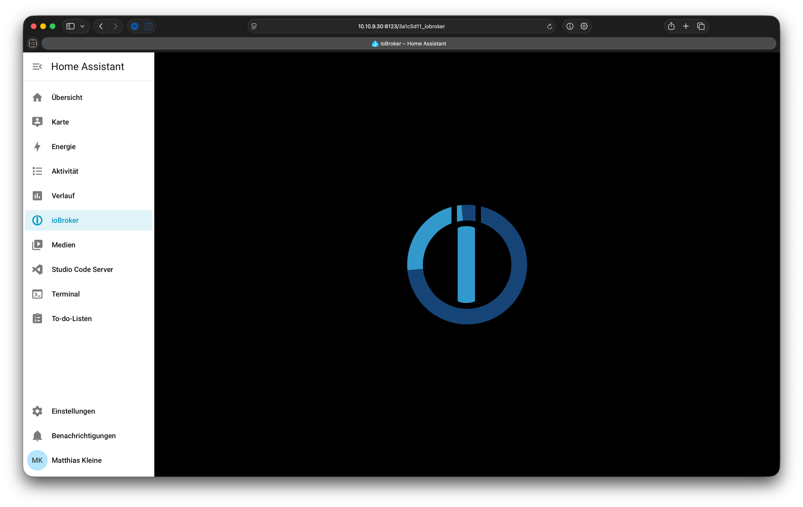

# Home Assistant App: ioBroker

[![GitHub Release][releases-shield]][releases]
![Project Stage][project-stage-shield]
[![License][license-shield]](LICENSE.md)

![Supports aarch64 Architecture][aarch64-shield]
![Supports amd64 Architecture][amd64-shield]

[![Github Actions][github-actions-shield]][github-actions]
![Project Maintenance][maintenance-shield]
[![GitHub Activity][commits-shield]][commits]

Flow-based programming for the Internet of Things.

## About

[:books: Read the full app documentation][docs]

## Installation

1. In Home Assistant go to **[Settings → Apps → App store](https://my.home-assistant.io/redirect/supervisor_store/)**
2. Click **⋮ → Repositories**, fill in  `https://github.com/klein0r/ha-app-iobroker` and click **Add → Close** or click the **Add repository** button below, click **Add → Close** (You might need to enter the **internal IP address** of your Home Assistant instance first).
   

## License

MIT License

Copyright (c) 2026 Matthias Kleine <info@haus-automatisierung.com>

Permission is hereby granted, free of charge, to any person obtaining a copy
of this software and associated documentation files (the "Software"), to deal
in the Software without restriction, including without limitation the rights
to use, copy, modify, merge, publish, distribute, sublicense, and/or sell
copies of the Software, and to permit persons to whom the Software is
furnished to do so, subject to the following conditions:

The above copyright notice and this permission notice shall be included in all
copies or substantial portions of the Software.

THE SOFTWARE IS PROVIDED "AS IS", WITHOUT WARRANTY OF ANY KIND, EXPRESS OR
IMPLIED, INCLUDING BUT NOT LIMITED TO THE WARRANTIES OF MERCHANTABILITY,
FITNESS FOR A PARTICULAR PURPOSE AND NONINFRINGEMENT. IN NO EVENT SHALL THE
AUTHORS OR COPYRIGHT HOLDERS BE LIABLE FOR ANY CLAIM, DAMAGES OR OTHER
LIABILITY, WHETHER IN AN ACTION OF CONTRACT, TORT OR OTHERWISE, ARISING FROM,
OUT OF OR IN CONNECTION WITH THE SOFTWARE OR THE USE OR OTHER DEALINGS IN THE
SOFTWARE.

[iobroker]: https://www.iobroker.net
[iobroker-docs]: https://www.iobroker.net/#en/documentation
[project-stage-shield]: https://img.shields.io/badge/project%20stage-production%20ready-brightgreen.svg
[releases-shield]: https://img.shields.io/github/release/klein0r/ha-app-iobroker.svg
[releases]: https://github.com/klein0r/ha-app-iobroker/releases
[license-shield]: https://img.shields.io/github/license/klein0r/ha-app-iobroker.svg
[aarch64-shield]: https://img.shields.io/badge/aarch64-yes-green.svg
[amd64-shield]: https://img.shields.io/badge/amd64-yes-green.svg
[github-actions-shield]: https://github.com/klein0r/ha-app-iobroker/workflows/CI/badge.svg
[github-actions]: https://github.com/klein0r/ha-app-iobroker/actions
[maintenance-shield]: https://img.shields.io/maintenance/yes/2026.svg
[commits-shield]: https://img.shields.io/github/commit-activity/y/klein0r/ha-app-iobroker.svg
[commits]: https://github.com/klein0r/ha-app-iobroker/commits/main
[docs]: https://github.com/klein0r/ha-app-iobroker/blob/main/iobroker/DOCS.md
